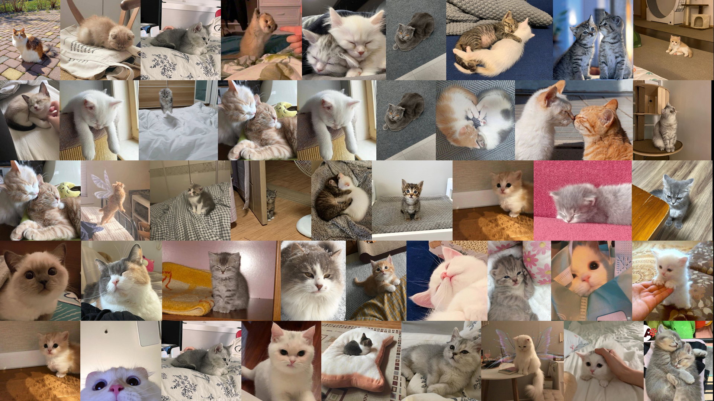

# `collager` - Python collage maker

Creates a collage of a given size and number of lines using images from a given folder



```python
path = "/cats_dataset/best"
width, height = (1920, 1080)
lines = 5
```

Optimized by splitting the collage into separate lines that are created separately. A small and almost imperceptible cropping of the original image is also allowed, so that each line is generated even faster
